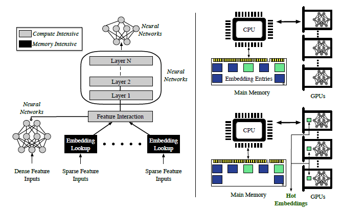

# Accelerating RecSys Training (FAE)

This repository contains the source code implementation of the following
paper:
- "[Accelerating recommendation system training by leveraging popular choices](http://people.ece.ubc.ca/adnan/assets/pdf/FAE.pdf)",
  which appeared at VLDB 2022.

<br>
<div style="text-align: center; margin: 20pt">
  <figcaption style="font-style: italic;"></figcaption>
</div>

DLRM:
-----
An implementation of a deep learning recommendation model (DLRM)
The model input consists of dense and sparse features. The former is a vector
of floating point values. The latter is a list of sparse indices into
embedding tables, which consist of vectors of floating point values.
The selected vectors are passed to mlp networks denoted by triangles,
in some cases the vectors are interacted through operators (Ops).
```
output:
                    probability of a click
model:                        |
                             /\
                            /__\
                              |
      _____________________> Op  <___________________
    /                         |                      \
   /\                        /\                      /\
  /__\                      /__\           ...      /__\
   |                          |                       |
   |                         Op                      Op
   |                    ____/__\_____           ____/__\____
   |                   |_Emb_|____|__|    ...  |_Emb_|__|___|
input:
[ dense features ]     [sparse indices] , ..., [sparse indices]
```
 More precise definition of model layers:
 1) fully connected layers of an mlp

    z = f(y)

    y = Wx + b

 2) embedding lookup (for a list of sparse indices p=[p1,...,pk])

    z = Op(e1,...,ek)

    obtain vectors e1=E[:,p1], ..., ek=E[:,pk]

 3) Operator Op can be one of the following

    Sum(e1,...,ek) = e1 + ... + ek

    Dot(e1,...,ek) = [e1'e1, ..., e1'ek, ..., ek'e1, ..., ek'ek]

    Cat(e1,...,ek) = [e1', ..., ek']'

    where ' denotes transpose operation

Dataset Pre-processing
----------------------
```
     cd DLRM

```
1) The code supports interface with the [Criteo Kaggle Display Advertising Challenge Dataset](https://labs.criteo.com/2014/02/kaggle-display-advertising-challenge-dataset/).
   - Please do the following to prepare the dataset for use with DLRM code:
     - First, specify the raw data file (train.txt) as downloaded with --raw-data-file=<./input/kaggle/train.txt>
     - This is then pre-processed (categorize, concat across days...) to allow using with dlrm code
     - The processed data is stored as *.npz file in ./input/kaggle/*.npz
     - The processed file (*.npz) can be used for subsequent runs with --processed-data-file=<./input/kaggle/*.npz>
   - Criteo kaggle can be pre-processed using the following script
     ```
     ./bench/dlrm_s_criteo_kaggle.sh
     ```

2) The code supports interface with the [Criteo Terabyte Dataset](https://labs.criteo.com/2013/12/download-terabyte-click-logs/).
   - Please do the following to prepare the dataset for use with DLRM code:
     - First, download the raw data files day_0.gz, ...,day_23.gz and unzip them
     - Specify the location of the unzipped text files day_0, ...,day_23, using --raw-data-file=<./input/terabyte/day> (the day number will be appended automatically)
     - These are then pre-processed (categorize, concat across days...) to allow using with dlrm code
     - The processed data is stored as *.npz file in ./input/terabyte/*.npz
     - The processed file (*.npz) can be used for subsequent runs with --processed-data-file=<./input/terabyte/*.npz>
   - Criteo Terabyte can be pre-processed using the following script
    ```
      ./bench/dlrm_s_criteo_terabyte.sh
    ```

FAE Profiling
-------------

FAE profiler profiles the highly accessed embeddings based on defined input sampling rate and available GPU memory.
It segregates the data into hot and cold data and save respective segregated data in ./input/<dataset>/<hot_cold_dataset> folder along with respective embedding dictionary.
FAE profiling of data into hot and cold can be run on CPU only using following script
```
     ./run_fae_profiler.sh
```

Running Baseline - CPU
----------------------

Baseline can be run on CPU only using following script
```
     ./run_dlrm_baseline_cpu.sh
```

Running Baseline - CPU_GPU
--------------------------

Baseline can be run CPU_GPU using following script
```
     ./run_dlrm_baseline_cpu_gpu.sh
```

Running FAE
-----------

FAE can be run only on CPU_GPU using following script
```
     ./run_dlrm_fae.sh
```


TBSM:
-----
TBSM consists of an embedding layer and time series layer (TSL).

The embedding layer is implemented through (DLRM). Within this layer
all sparse features pass through embeddings, while dense features
pass through MLP. The MLP maps dense features into the vector space of
the same dimension as the embedding dimension for all sparse features.
In the next step the vector of all pairwise inner products between
embedded sparse and mapped dense features is formed. Finally, this
vector of inner products is concatenated with an output vector from MLP
and passed through the top MLP, which produces a vector z of dimensions n.

Let us denote z_i the history of items, and z_t the last item. The TSL layer
computes one or more context vectors c. It ressembles an attention mechanism,
and contains its own MLP network with trainable parameters. The attention MLP
takes a vector of inner products between normalized z_i and z_t and outputs
the vector of coefficients a which is applied to z_i  to obtain the context
vector c. In this way, c measures the significance of each of the z_i with respect
to vector z_t. For example, if the first component of a is 1 while the rest are 0,
then c = z_0. The distinction with standard attention mechanisms lies in the
normalization (spherical projection) use of well defined inner products and
use of individual rather than shared MLP for multiple context vectors.

The final step takes vectors [z_t, c_j] and passes them through MLPs
resulting in the probability of a click.

```
   model:
               probability of a click
                         |
                        /\
                       /__\
                         |
              _________ op ___________
            /            |            \
  (context) c                 (candidate) z_t
  (vector )                   (embedding)
              \                     /
                 \                 /
                     attention    /
                     /       \   /
                    H           z_t
                  /             |
                 /              |
              DLRM            DLRM
              /                 |
   user history             new item

 model components
 i) Embedding layer (DLRM)
                    item tower output vector z
                               |
                              /\
                             /__\
                               |
       _____________________> Op  <___________________
     /                         |                      \
    /\                        /\                      /\
   /__\                      /__\           ...      /__\
    |                          |                       |
    |                         Op                      Op
    |                    ____/__\_____           ____/__\____
    |                   |_Emb_|____|__|    ...  |_Emb_|__|___|
 item input:
 [ dense features ]     [sparse indices] , ..., [sparse indices]

 ii) TSL layer, processing history (a sequence of vectors used in the attention)

          z1,       z2,   ...   zk   -->   H = [z1, z2, ..., zk]
          |         |           |
         DLRM,     DLRM, ...   DLRM
          |         |           |
 previous i1       i2   ...    ik features

 TSL functions similarly to attention mechanism, with three important distinctions
 a. The vectors are normalized (spherical projection)
 b. The product between vectors can be done using: dot v'w, indefinite v' A w and
    positive semi-definite v' (A'A) w inner product
 c. The multiple TSL heads have individual rather than shared output MLPs
```
Dataset Pre-processing
----------------------
```
     cd TBSM

```
The code supports interface with the [Taobao User Behavior Dataset](https://tianchi.aliyun.com/dataset/dataDetail?dataId=649&userId=1).
- Please do the following to prepare the dataset for use with TBSM code:
    - Download UserBehavior.csv.zip and UserBehavior.csv.zip.md5 into directory
      ```
      ./data/taobao_data
      ```
    - Check the md5sum hash and unzip
       ```
       md5sum UserBehavior.csv.zip
       unzip UserBehavior.csv.zip
       ```
    - Run preprocessing to create input files (*taobao_train.txt* and *taobao_test.txt*)
       ```
       python ./tools/taobao_prepare.py
       ```
    - Copy input files (*taobao_train.txt* and *taobao_test.txt*) to ./input
       ```
       cp ./data/taobao_data/*.txt ./input/.
       ```
    - Run preprocessing to create processed files (*taobao_train_t20.npz* *taobao_val_t20.npz* *train.npz* *val.npz*)
       ```
       ./tbsm_processing.sh
       ```

FAE Profiling
-------------

FAE profiler profiles the highly accessed embeddings based on defined input sampling rate and available GPU memory.
It segregates the data into hot and cold data and save respective segregated data in ./data/taobao_hot_cold folder along with respective embedding dictionary.
FAE profiling of data into hot and cold can be run on CPU only using following script
```
     ./run_fae_profiler.sh
```

Running Baseline - CPU
----------------------

Baseline can be run on CPU only using following script
```
     ./run_tbsm_baseline_cpu.sh
```

Running Baseline - CPU_GPU
--------------------------

Baseline can be run CPU_GPU using following script
```
     ./run_tbsm_baseline_cpu_gpu.sh
```

Running FAE
-----------

FAE can be run only on CPU_GPU using following script
```
     ./run_tbsm_fae.sh
```

Requirements
------------
pytorch-nightly

scikit-learn

numpy

pandas

onnx (*optional*)

pydot (*optional*)

torchviz (*optional*)

tqdm

cPickle


License
-------
This source code is licensed under the MIT license found in the
LICENSE file in the root directory of this source tree.
